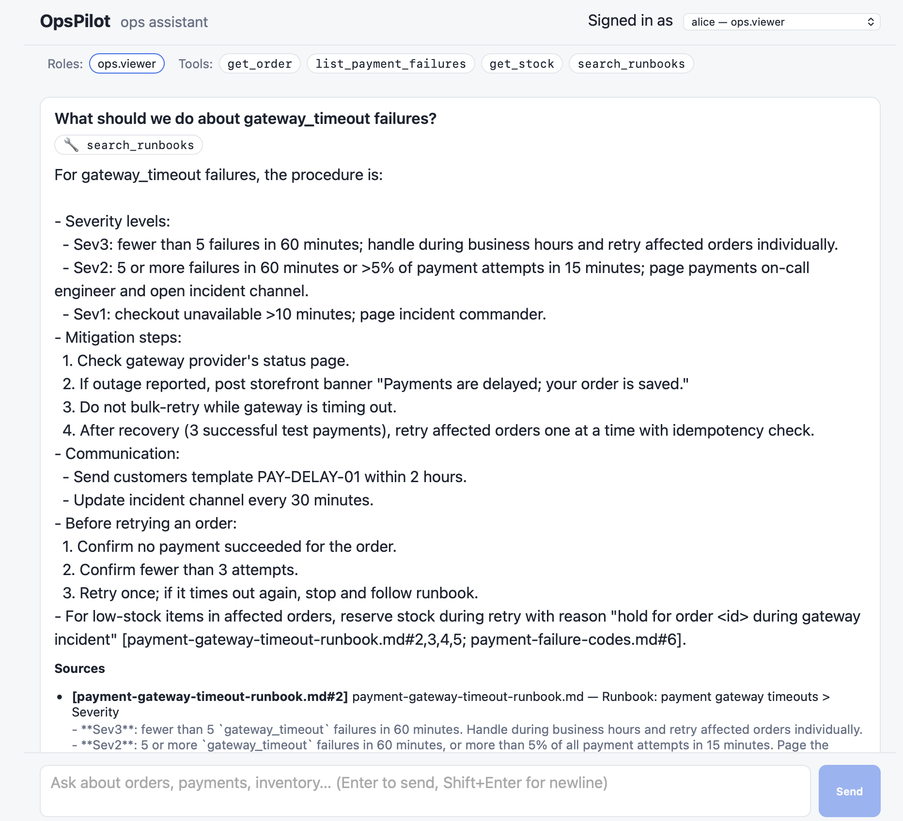

# OpsPilot

**An AI operations assistant for e‑commerce support teams.** OpsPilot answers
operational questions — *"Why did order 123 fail?"*, *"Are we in an incident
right now?"*, *"Can we retry this payment?"* — by combining a retrieval‑augmented
knowledge base of runbooks with live, permission‑scoped tools that read and act
on orders, payments, and inventory.

<p align="center">
  
</p>

<p align="center">
  
  
  
  
</p>

---

## Why OpsPilot

Support and on‑call engineers waste time stitching together three things: the
**runbook** that describes the procedure, the **system of record** that holds the
actual order/payment/stock data, and the **judgment** to decide what to do. OpsPilot
puts all three behind one chat box:

- **Grounded answers, not guesses.** Every operational answer is backed by
  retrieved runbook passages with inline citations — and the assistant declines
  when the knowledge base doesn't cover the question.
- **Tools that respect who's asking.** The model can look up an order or reserve
  stock, but which tools it's even allowed to call is decided by the signed‑in
  user's role. Viewers can read; operators can act.
- **Safe by default.** Fraud‑flagged orders are never auto‑retried, prompt‑injection
  attempts are refused, and write actions are idempotent.

## Features

- 🔎 **RAG over operational runbooks** — markdown knowledge base embedded into
  pgvector, retrieved by semantic similarity, with source citations in every answer.
- 🛠️ **Function‑calling tools** — the assistant reads orders, payment failures, and
  stock, and can retry payments or reserve inventory through a real backend API.
- 🔐 **Role‑scoped capabilities** — JWT‑based auth with `ops.viewer` / `ops.operator` /
  `ops.admin` roles; tools are offered to the model only when the caller is authorized.
- ⚡ **Streaming responses** — token‑by‑token answers over Server‑Sent Events to an
  Angular frontend, including live "tool call" events.
- 📊 **Built‑in observability** — OpenTelemetry traces for chat, tool calls, and AI
  requests, viewable in the Aspire dashboard.
- 🧪 **Quality eval suite** — a set of golden questions with expected tools and
  required/forbidden content for measuring answer quality.

## Architecture

```
┌──────────────┐   SSE / REST    ┌─────────────────────┐   REST    ┌────────────────┐
│  Angular web │ ───────────────▶│   Orchestrator      │ ─────────▶│    OpsApi      │
│   :4200      │   Bearer JWT    │   :5102             │  (fwd JWT)│    :5101       │
│  (chat UI)   │◀─────────────── │  chat · RAG · tools │◀───────── │ orders/payments│
└──────────────┘                 └──────────┬──────────┘           │   inventory    │
                                            │                      └───────┬────────┘
                               embeddings & chat                          │
                                            ▼                             ▼
                                 ┌─────────────────┐            ┌──────────────────┐
                                 │  Azure OpenAI   │            │ Postgres + pgvector│
                                 │  chat · embed   │            │  opsdb  ·  aidb    │
                                 └─────────────────┘            └──────────────────┘
```

- **Orchestrator** — the brains. Hosts the chat endpoint, runs retrieval against the
  knowledge base, exposes the tool catalog to the model, and enforces authorization.
- **OpsApi** — the system of record for orders, payments, and inventory. The
  orchestrator calls it as a tool and forwards the user's token so the API enforces
  the same permissions.
- **Angular web** — the chat experience: a user switcher, live streaming answers,
  tool‑call indicators, and citations.
- **Postgres / pgvector** — `opsdb` (operational data) and `aidb` (document embeddings).
- **Aspire dashboard** — traces and logs across all services.

## Tech stack

| Layer | Technology |
|-------|-----------|
| AI | Azure OpenAI (chat + embeddings) via `Microsoft.Extensions.AI` |
| Backend | .NET 10 Minimal APIs, EF Core 10, Npgsql |
| Vector store | PostgreSQL 17 + `pgvector` |
| Frontend | Angular 22 (standalone, SSE streaming) |
| Auth | JWT bearer with role‑based policies |
| Telemetry | OpenTelemetry + .NET Aspire dashboard |
| Infra | Docker Compose |

## Project structure

```
OpsPilot/
├── src/
│   ├── OpsPilot.Orchestrator/   # Chat, RAG, tools, auth — the AI service (:5102)
│   ├── OpsPilot.OpsApi/         # Orders, payments, inventory API (:5101)
│   └── OpsPilot.ServiceDefaults/# Shared auth + observability extensions
├── web/opspilot-web/            # Angular chat frontend (:4200)
├── knowledge/                   # Markdown runbooks (the RAG corpus)
├── eval/golden-questions.md     # Quality eval suite
├── scripts/                     # dev.sh, gen-tokens.sh
├── docker-compose.yml           # Postgres + Aspire dashboard
└── Makefile                     # make dev / infra / tokens / ...
```

## Getting started

### Prerequisites

- **.NET 10 SDK**
- **Docker** (Desktop running)
- **Node.js ≥ 24.15** (or ≥ 22.22.3) for the Angular CLI
- **Azure OpenAI** resource with `chat` and `embeddings` deployments
- **Azure CLI** signed in (`az login`) for keyless authentication

### 1. Configure the Azure OpenAI endpoint

Keyless auth is used by default, so you only need the resource endpoint:

```bash
dotnet user-secrets set "AzureOpenAI:Endpoint" \
  "https://<your-resource>.services.ai.azure.com/" \
  --project src/OpsPilot.Orchestrator
```

> Use the resource root — not a Foundry project path. The client appends
> `/openai/v1/` automatically.

### 2. Generate dev sign‑in tokens

```bash
make tokens
```

This mints four demo users (alice, bob, carol, mallory) with different roles and
writes them into the Angular app's git‑ignored `dev-tokens.ts`.

### 3. Run the whole stack

```bash
make dev
```

This brings up the Docker infra (waiting for Postgres to be healthy), then starts
the OpsApi, Orchestrator, and Angular dev server with interleaved, color‑tagged logs.
Databases and seed data are created automatically on first run.

Then open **http://localhost:4200**, pick a user from the switcher, and ask away.
Traces are at the Aspire dashboard on **http://localhost:18888**.

Press **Ctrl+C** to stop the app processes (the Docker infra keeps running).

## Make targets

| Target | What it does |
|--------|--------------|
| `make dev` | Start the full stack (infra + OpsApi + Orchestrator + Angular) |
| `make infra` | Start only the Docker infra (Postgres + Aspire dashboard) |
| `make down` | Stop the Docker infra (keeps the data volume) |
| `make stop` | Stop just the app processes (leaves infra running) |
| `make tokens` | (Re)generate dev JWTs into the Angular app |
| `make logs` | Tail the combined app logs |
| `make clean` | Stop infra and remove the data volume + logs |

## Roles, tools & permissions

The signed‑in user's role decides which tools the model is even allowed to use:

| Tool | Does | `viewer` | `operator` | `admin` |
|------|------|:---:|:---:|:---:|
| `search_runbooks` | Semantic search over the knowledge base | ✅ | ✅ | ✅ |
| `get_order` | Look up an order and its payment state | ✅ | ✅ | ✅ |
| `list_payment_failures` | Recent payment failures by code | ✅ | ✅ | ✅ |
| `get_stock` | Current stock for a SKU | ✅ | ✅ | ✅ |
| `retry_payment` | Retry a failed payment (idempotent) | — | ✅ | ✅ |
| `reserve_stock` | Reserve inventory for an order | — | ✅ | ✅ |

When a viewer asks for a write action, the assistant explains it lacks permission
instead of attempting it.

## Knowledge base

RAG answers are grounded in the markdown runbooks under `knowledge/`:

- `payment-gateway-timeout-runbook.md` — incident severity & mitigation for gateway timeouts
- `payment-failure-codes.md` — what each failure code means and whether retry is safe
- `fraud-review-procedure.md` — handling fraud‑suspected orders (never auto‑retry)
- `inventory-reservations.md` — reservation rules and limits
- `refund-and-cancellation-policy.md` — refund approval thresholds

Edit or add a markdown file and it's re‑embedded on the next startup ingestion
(or via the admin ingest endpoint).

## API reference

### Orchestrator (`:5102`)

| Method | Route | Policy | Purpose |
|--------|-------|--------|---------|
| GET  | `/api/me` | CanView | Current user's roles and available tools |
| POST | `/api/chat` | CanView | Streamed chat (SSE) |
| GET  | `/api/knowledge/documents` | CanView | List ingested documents |
| GET  | `/api/knowledge/search` | CanView | Raw semantic search |
| POST | `/api/admin/ingest` | CanAdmin | Re‑ingest the knowledge base |
| GET  | `/health` | — | Liveness |

### OpsApi (`:5101`)

| Method | Route | Policy | Purpose |
|--------|-------|--------|---------|
| GET  | `/orders/{id}` | CanView | Order details |
| POST | `/orders/{id}/payments/retry` | CanOperate | Retry a payment |
| GET  | `/payments/failures` | CanView | Recent payment failures |
| GET  | `/inventory/{sku}` | CanView | Stock for a SKU |
| POST | `/inventory/{sku}/reservations` | CanOperate | Reserve stock |

OpenAPI for OpsApi is served at `http://localhost:5101/openapi/v1.json` in development.

## Configuration

| Setting | Where | Notes |
|---------|-------|-------|
| `AzureOpenAI:Endpoint` | user secrets | Required; resource root URL |
| `AzureOpenAI:ApiKey` | user secrets | Optional; omit to use keyless (`DefaultAzureCredential`) |
| `AzureOpenAI:ChatDeployment` / `EmbeddingDeployment` | appsettings | Default `chat` / `embeddings` |
| `ConnectionStrings:KnowledgeDb` / `OpsDb` | appsettings | Postgres on `:5433` |
| `Cors:Origins` | appsettings | Allowed web origins (default `http://localhost:4200`) |
| `Knowledge:IngestOnStartup` | appsettings | Re‑embed runbooks on boot |
| `AZURE_TOKEN_CREDENTIALS=dev` | env | Uses developer credentials (e.g. Azure CLI) for keyless auth off‑Azure |

## Quality evaluation

`eval/golden-questions.md` is a reproducible test set: each row pairs a user and
question with the tools the assistant should call and the content its answer must —
and must not — contain. It covers grounded answers, permission boundaries,
fraud‑safety, prompt‑injection refusals, and off‑topic handling. Use it to spot
regressions when changing models, prompts, or retrieval settings.

## License

See repository for license details.
